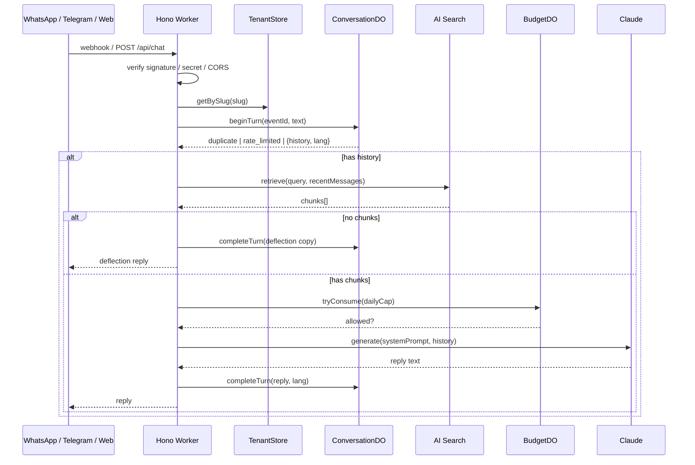

# Architecture

## Data flow



Every channel adapter normalizes its provider's payload into `InboundMessage`
(`shared/src/channel.ts`) and calls the same `core/pipeline.ts#handleTurn` — the pipeline itself
never imports a channel-specific type. This is what makes adding a channel (see `docs/TELEGRAM.md`
for the one that's already done this way) a matter of one new adapter directory, not a pipeline
change.

## Decisions log

### Durable Object per conversation, not D1

One `ConversationDO`, addressed by `idFromName(\`${tenantId}:${channel}:${senderHash}\`)`, owns three
things that are written together on every turn: message history, redelivery dedup, and the
per-sender daily quota.

- **Ordering for free.** A Durable Object serializes every call made to it. Two near-simultaneous
  webhook deliveries — Meta retrying because our first response was slow — cannot race on a
  read-modify-write of the conversation history. With D1, this needs an application-level lock or
  optimistic concurrency on a version column; with a DO it's just how the primitive works.
- **Dedup and append are atomic** because they're two statements inside one serialized call, not two
  round trips to a shared database that something else could interleave with.
- **Locality.** A DO's storage lives with the object; repeated reads/writes for one conversation
  don't round-trip to a single-region database primary.
- **Free-tier fit.** SQLite-backed Durable Objects are available (and their storage untouched by
  billing) on the Workers Free plan.

What this gives up: cross-conversation queries ("how many chats this week"). Not built — Workers
Logs (structured `console.log`, see `lib/log.ts`) cover debugging; a fire-and-forget analytics write
to D1 is the natural extension if aggregate reporting is ever needed, and it would sit alongside the
DO as the system of record, not replace it.

**PII:** the raw phone number / chat id is never persisted. It addresses the DO (hashed via
`lib/hash.ts`, HMAC-SHA256 with a deployment-wide salt) and is used once, in the same request, to
send the reply. The DO only ever stores the hash.

### Rate limiting: three layers, cheapest first

| #   | Layer                   | Mechanism                                           | Why                                                                                                                                                                             |
| --- | ----------------------- | --------------------------------------------------- | ------------------------------------------------------------------------------------------------------------------------------------------------------------------------------- |
| 1   | Burst brake             | Workers `ratelimits` binding                        | Cheap, but Cloudflare's own docs describe it as per-location and eventually consistent — "not an accurate accounting system." Good for absorbing a burst, not for an exact cap. |
| 2   | Per-sender daily quota  | Inside `ConversationDO` (exact, because serialized) | The real cap on any one sender.                                                                                                                                                 |
| 3   | Per-tenant daily budget | `BudgetDO`, checked before every Claude call        | Bounds aggregate spend even if many distinct senders each individually stay under their own quota.                                                                              |

**Why not KV for any of this:** the Workers free tier allows 1,000 KV writes per account per day. A
KV-backed counter writes on every inbound message; ordinary traffic would exhaust the account-wide
write quota, after which the limiter itself starts failing — the worst possible failure mode for a
rate limiter. Layer 2's writes ride along with a DO call that's already happening on every turn, so
there's no additional quota pressure; layer 1 has no storage cost at all.

### `search()` + a manual Claude call, not AI Search's `chat()`

AI Search can generate answers itself (`instance.chat()` / `chatCompletions()`), including via an
Anthropic provider key configured on its own AI Gateway. This project uses `search()` for retrieval
and a direct `@anthropic-ai/sdk` call for generation instead:

- The system prompt — persona, grounding rule, deflection behavior, per-locale rules, per-channel
  style — lives in `core/prompt.ts`, versioned and unit-tested, not a dashboard setting.
- Model choice and parameters are ours (and this project needs Haiku-specific handling — see
  `CLAUDE.md`'s model gotchas — that a generic `chat()` call wouldn't expose control over).
- Failure modes stay distinguishable: a retrieval failure (`core/errors.ts`'s `retrieval_failed`) is
  a different, more honest user-facing message than a generation failure.

### Namespace AI Search binding, not the single-instance form

```jsonc
"ai_search_namespaces": [{ "binding": "AI_SEARCH", "namespace": "default", "remote": true }]
```

The single-instance `ai_search` binding is simpler for a fixed one-bot deployment, but its methods
are bound to one instance name at deploy time. Multi-tenant mode calls `env.AI_SEARCH.get(instanceName)`
with a _different_ name per tenant at request time — the namespace binding is what makes that
possible. `remote: true` is required either way: AI Search never runs locally, so `wrangler dev`
proxies these calls to your real, deployed instance. This is also why **tests never touch this
binding** — see `wrangler.test.jsonc` and the note in `CLAUDE.md`.

### Third-person persona

The bot answers _about_ the tenant's subject, never _as_ them ("Jorge is available for new projects
according to the site", not "I'm available"). First-person impersonation invites the model to make
commitments — availability, pricing, promises — that a real person would be held to. Third person
keeps every claim attributable to "what the site says," which is also what the grounding rule and the
deflection behavior are built around.

### Context window: fixed 12-message slide, no summarization (yet)

`claude-haiku-4-5` has a 200K context window; twelve short chat messages is a rounding error against
it. Summarization would cost a second LLM call on every overflow turn and adds a failure mode (a bad
summary poisons every later turn) for a bot where most turns are independent lookups, not a
long-running task. Older messages age out via `ConversationDO#alarm()` (30-day retention) rather than
being compacted.

The extension point already exists: `core/prompt.ts#buildSystemPrompt` renders a
`<conversation_summary>` section whenever a `summary` string is passed, and does nothing when it
isn't. Turning summarization on later is "compute a summary and pass it in," not a prompt redesign.

### Single-tenant vs. multi-tenant (SaaS)

Two `TenantStore` implementations (`api/src/tenancy/tenant-store.ts`) behind one interface:

- **`SingleTenantStore`** — one `Tenant` assembled from `config/persona.ts` + env secrets. No D1
  dependency; the simplest possible "fork and deploy your own bot" path.
- **`D1TenantStore`** — tenants as D1 rows, channel credentials AES-256-GCM-encrypted at rest
  (`lib/crypto.ts`), managed via the `/admin/tenants` JSON API. See `docs/SAAS.md`.

`TENANT_MODE` (a `wrangler.jsonc` var) picks one at request time; nothing else in the codebase
branches on it — every route resolves a `Tenant` through `TenantStore` and doesn't know or care which
mode produced it.

### Non-streaming replies (v1)

One request, one JSON response, with a typing indicator client-side during the wait. At
`max_tokens: 800`, Haiku 4.5 typically replies in a few seconds — tolerable without the added
complexity of a second, stream-aware response path per channel. Listed as a deferred extension below.

## Deferred extensions (not built, on purpose)

- **SSE streaming** for the web widget.
- **Cloudflare Turnstile** on `/api/chat` if abuse shows up (the web channel has no signature to
  verify, unlike WhatsApp/Telegram, so it's the softest target).
- **D1 analytics** — an append-only table of turns for aggregate reporting, alongside (not replacing)
  the Durable Objects.
- **Rolling summarization** — see "Context window" above; the prompt plumbing already exists.
- **Additional languages** beyond en/es/zh, or verifying zh quality against a knowledge base that's
  currently en/es — see `docs/EVAL.md`.
